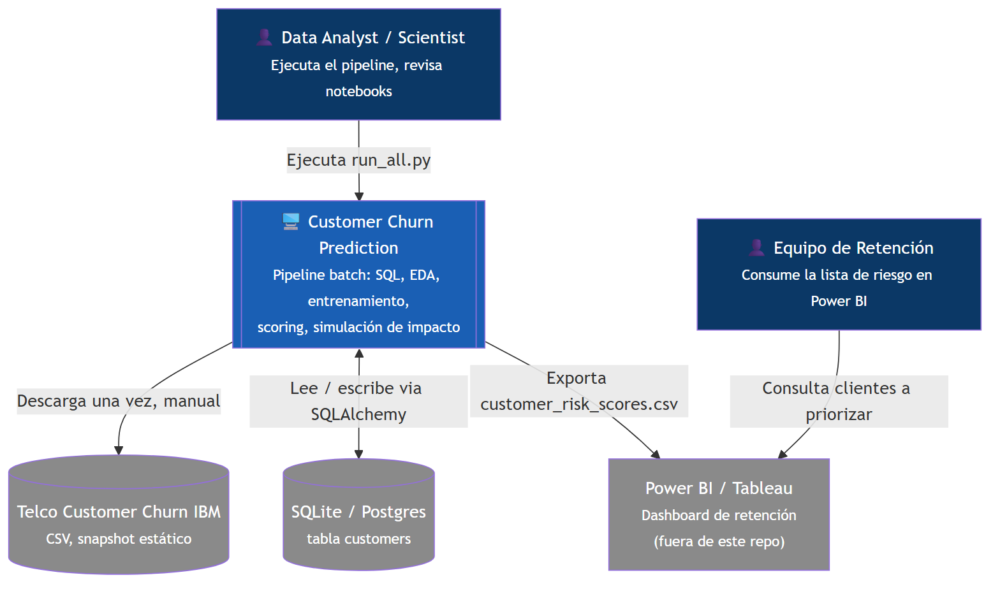
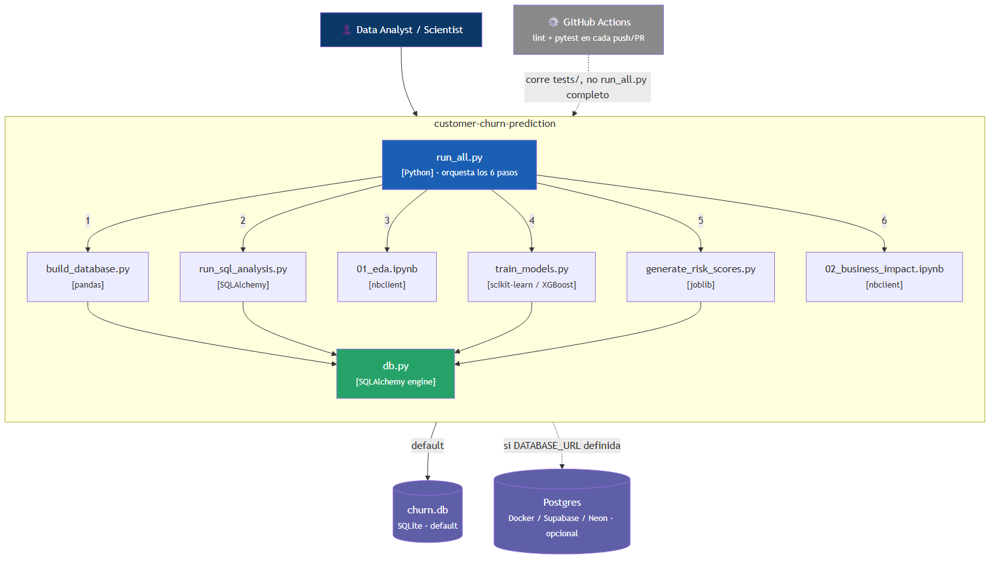
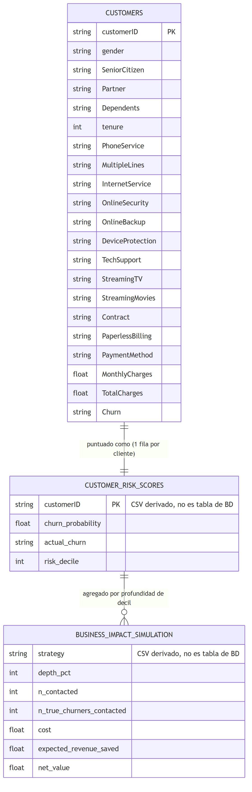
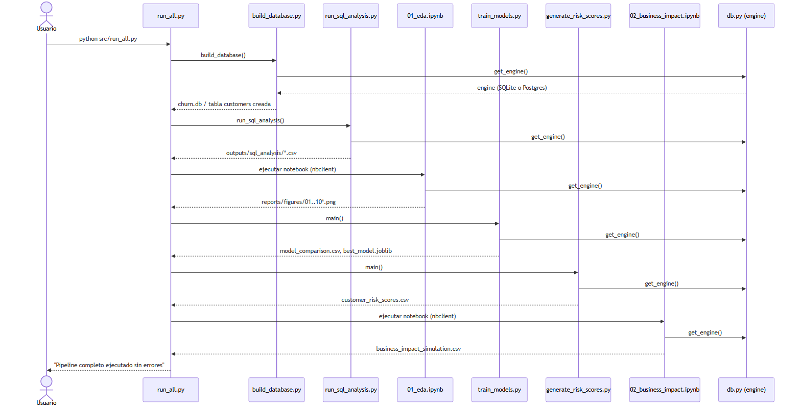
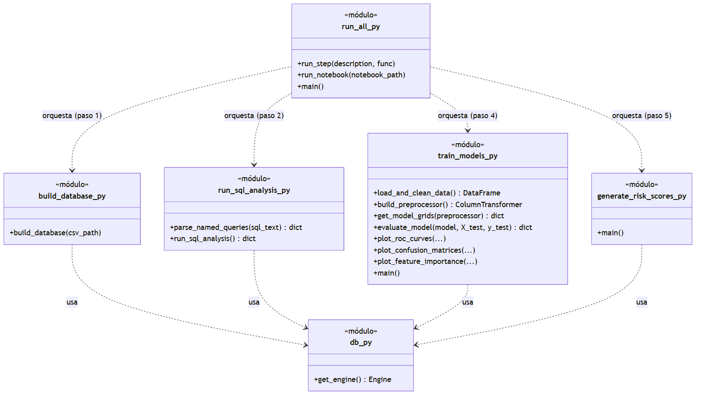
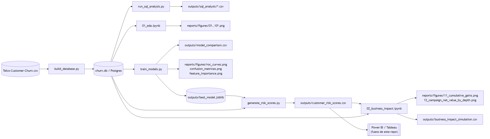

# Arquitetura

Documento vivo: se uma decisão aqui descrita mudar, este arquivo é
atualizado e uma nova [ADR](adr/) é adicionada explicando o porquê da
mudança.

> Os diagramas abaixo são **imagens PNG geradas** a partir de código
> fonte versionado em [`docs/diagrams/src/*.mmd`](diagrams/src/)
> (sintaxe [Mermaid](https://mermaid.js.org/)), não desenhados à mão.
> Para regenerá-los após editar um `.mmd`:
> ```bash
> npx -y @mermaid-js/mermaid-cli -i docs/diagrams/src/NOME.mmd -o docs/diagrams/NOME.png -b white -s 2
> ```
> (requer Node.js; não é preciso instalar nada permanentemente, o `npx` baixa na hora).

## 1. Diagrama de contexto

Quem usa o sistema e com quais outros sistemas ele interage.



## 2. Diagrama de containers

Como o sistema se decompõe em peças executáveis.



**Nota importante sobre Neon/Postgres:** este diagrama mostra o `db.py`
falando diretamente com o motor de banco de dados (protocolo binário do
Postgres via `psycopg2`), **não** uma API HTTP/REST. Quando você conecta
este projeto ao Neon (ou Supabase, ou Render), não há nenhum "deploy"
deste repositório nesses serviços — o Neon apenas hospeda o banco de
dados. Seu script Python continua rodando na sua máquina (ou no GitHub
Actions) e se conecta *para fora*, ao banco de dados remoto, com uma
string de conexão. É exatamente o mesmo que se conectar com DBeaver ou
pgAdmin a um Postgres remoto, só que o "cliente" é seu código Python em
vez de uma ferramenta gráfica. Não existe um "deploy" prévio a fazer: no
momento em que o Neon mostrou a tela de "Your new project was created",
o banco de dados já está vivo e aceitando conexões.

## 3. Diagrama de entidade-relacionamento

Este projeto tem **uma única tabela real** no banco de dados
(`customers`). As demais "entidades" deste diagrama são arquivos CSV
derivados (não tabelas do banco de dados), incluídas para mostrar como se
relacionam logicamente com `customers`.



Detalhe completo de cada campo em [`docs/data_dictionary.md`](data_dictionary.md).

## 4. Diagrama de sequência (orquestração do `run_all.py`)

Como os módulos interagem no tempo quando você roda
`python src/run_all.py` — responde "quem chama quem, em que ordem".



## 5. Diagrama de módulos e funções

Este projeto **não usa classes próprias** (é código funcional: scripts
com funções, mais as classes do scikit-learn como `Pipeline` e
`ColumnTransformer`, que são da biblioteca, não nossas). Por isso não
existe um diagrama de classes UML tradicional do domínio — em vez disso,
este diagrama usa a notação de "classe" do UML para representar **cada
módulo `.py` como uma unidade**, com suas funções públicas como métodos,
para mostrar quem depende de quem.



## 6. Fluxo de dados (detalhe dos outputs)



## 7. Decisões estruturais (resumo — detalhe nas ADRs)

| Decisão | Resumo | ADR |
|---|---|---|
| SQLite por padrão, Postgres opcional | Configuração zero para reproduzir; Postgres disponível sem mudar código | [ADR-0001](adr/0001-sqlite-por-defecto-postgres-opcional.md) |
| Batch/offline, sem API nem tempo real | O caso de uso (scoring semanal/mensal para BI) não exige baixa latência | [ADR-0002](adr/0002-pipeline-batch-offline.md) |
| Scripts `.py` para lógica, notebooks só para exploração | Separar o reproduzível/testável do narrativo/visual | [ADR-0003](adr/0003-separar-scripts-de-notebooks.md) |
| Split estratificado + ROC-AUC | Classes desbalanceadas (~26.5% positivos) | [ADR-0004](adr/0004-split-estratificado-y-roc-auc.md) |
| Modelo serializado (joblib), sem serviço de inferência | O consumidor é um CSV para BI, não um app ao vivo | [ADR-0005](adr/0005-serializar-pipeline-sin-servicio-de-inferencia.md) |
| Backtest retrospectivo para impacto de negócio | Não existe feedback real de campanhas; é simulado com `actual_churn` histórico | [ADR-0006](adr/0006-backtest-retrospectivo-impacto-negocio.md) |
| Prefect em vez de Airflow | Mesmo conceito (tarefas, retries, logs), sem o custo de ~4 containers só para orquestrar | [ADR-0007](adr/0007-prefect-en-vez-de-airflow.md) |
| Simular CRM/ERP normalizando o mesmo dataset | Evita fabricar um join falso entre datasets não relacionados | [ADR-0008](adr/0008-simular-crm-erp-normalizando-mismo-dataset.md) |
| CI contra Neon real via GitHub Secret | Prova verificável (não estática) de que o projeto funciona com Postgres real na nuvem | [ADR-0009](adr/0009-ci-contra-neon-real-via-secret.md) |

## 7.1. Trilha adicional: padrão enterprise (`warehouse_demo/`)

Além do pipeline simples documentado nas seções 1-6, o repositório inclui
uma segunda trilha paralela em [`warehouse_demo/`](../warehouse_demo/README.md)
que implementa de verdade o padrão `CRM/ERP → Orquestrador → Warehouse →
dbt → Feature Table → Modelo → Scores` usado em empresas grandes —
testado ponta a ponta contra Postgres real (25/25 tests do dbt, pipeline
completo via Prefect sem erros). Não substitui o pipeline simples, é uma
peça adicional do portfólio.


## 8. DevOps ou MLOps?

Nenhum dos dois em sua forma madura — mas vale a pena ser preciso sobre
o que cada termo significa e qual parte de cada um está realmente
presente.

**DevOps** = práticas para construir, testar, implantar e operar
software de forma confiável: CI/CD, infraestrutura reproduzível
(containers), testes automatizados, controle de versão disciplinado. É
agnóstico a se o software inclui Machine Learning ou não.

**MLOps** = DevOps *mais* as preocupações específicas de sistemas de ML:
versionamento de dados e de modelos (não só de código), tracking de
experimentos, registro de modelos (model registry), monitoramento de
*drift* de dados e de performance do modelo em produção, retreinamento
automático quando o modelo se degrada. Reproduzir um resultado de ML
exige fixar código + dados + hiperparâmetros + ambiente, não só código —
por isso o MLOps é mais amplo que o DevOps.

**Este projeto tem:**

| Prática | Presente? | Onde |
|---|---|---|
| CI (lint + testes automáticos) | Sim — DevOps | `.github/workflows/ci.yml` |
| Ambiente reproduzível (container) | Sim, parcial — DevOps | `docker-compose.yml` (só para o BD, não para o código) |
| Controle de versão de código | Sim — DevOps | git |
| Testes automatizados do pipeline | Sim — DevOps/MLOps | `tests/` |
| Versionamento de dados (DVC ou similar) | **Não** | Listado em "Próximos passos" do README |
| Tracking de experimentos (MLflow) | **Não** | Listado em "Próximos passos" do README |
| Registro de modelos (model registry) | **Não** — serializa um único `.joblib` manualmente | — |
| Monitoramento de *drift* em produção | **Não** — não há "produção" real, é batch sob demanda | — |
| Retreinamento automático | **Não** — retreina manualmente rodando `train_models.py` | — |

**Conclusão honesta:** o projeto pratica **DevOps básico aplicado a um
projeto de dados** (CI, testes, containers para a infraestrutura de
dados). Ainda **não é MLOps** no sentido maduro do termo, porque faltam
as peças específicas de ML (tracking, registry, drift, retreinamento
automático) — que estão identificadas e listadas como trabalho futuro,
não escondidas nem fingidas como já resolvidas.

## 9. O que este sistema NÃO é (limites explícitos)

Ver também a seção "Próximos passos" do [README](../README.md).

- Não é um sistema em tempo real nem expõe uma API HTTP própria. O Neon
  expõe Postgres (protocolo de banco de dados), não um endpoint REST
  deste projeto.
- Não tem retreinamento automático, registro de modelos (MLflow) nem
  monitoramento de *drift* — estão listados como trabalho futuro, não
  implementados.
- Não tem feedback loop real (o notebook de impacto de negócio é um
  backtest retrospectivo, não uma medição de campanha real).
- Não lida com PII real (o dataset já vem anonimizado); se fosse
  conectado a dados reais de clientes, seria necessária uma camada de
  governança de dados que este projeto não implementa.
