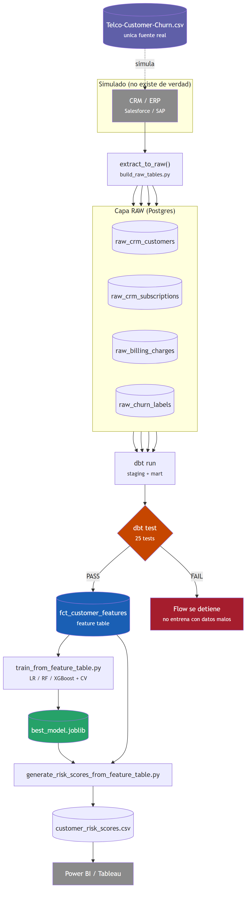

# warehouse_demo — padrão de arquitetura enterprise

O resto do repositório (`src/`, `notebooks/`) é o pipeline simples:
SQLite por padrão, uma única tabela `customers`, configuração zero. Esta
pasta é uma **trilha paralela** que demonstra o padrão usado por
empresas grandes para o mesmo problema de churn:

```
CRM / ERP  →  Orquestrador  →  Warehouse  →  dbt  →  Feature Table  →  Modelo  →  Scores
(simulado)     (Prefect)      (Postgres/Neon)              (fct_customer_features)
```



Não substitui o pipeline simples — coexiste com ele. Ver
[ADR-0007](../docs/adr/0007-prefect-en-vez-de-airflow.md) e
[ADR-0008](../docs/adr/0008-simular-crm-erp-normalizando-mismo-dataset.md)
para o porquê de cada decisão desta pasta.

## O que é real e o que é simulado

| Camada | Real? |
|---|---|
| CRM/ERP (Salesforce/SAP) | **Simulado** — não existem; o mesmo CSV é normalizado em tabelas separadas (`build_raw_tables.py`) |
| Orquestrador | **Real** (Prefect) — tarefas com dependências, retries e logs de verdade |
| Warehouse | **Simulado com Postgres real** — Neon/Docker Postgres funcionam de verdade, mas tecnicamente não são um warehouse colunar como Snowflake/BigQuery |
| dbt | **100% real** — projeto dbt-postgres real, com `sources`, `staging`, tests e um `mart` |
| Feature Table | **Real** — tabela `fct_customer_features` gerada pelo dbt |
| Modelo / Scores | **Real** — mesmo código de modelagem de `src/train_models.py`, reutilizado sem duplicar |

## Requisitos

Esta trilha precisa de Postgres real (dbt-postgres não funciona com
SQLite). Não roda com a configuração padrão do resto do repositório.

```bash
pip install -r requirements-warehouse.txt
```

## Como rodar

### 1. Subir o Postgres (local com Docker, ou Neon/Supabase)

```bash
cp .env.example .env
docker compose up -d
```

Ou preencher `.env` com os dados do seu Neon/Supabase (ver a seção
"Uso opcional do Postgres" do README principal). O `.env` já inclui as
variáveis que o dbt precisa (`PGHOST`, `PGPORT`, `PGUSER`,
`PGPASSWORD`, `PGDATABASE`, `PGSSLMODE`), além de `DATABASE_URL` que a
parte Python usa.

### 2. Rodar o flow completo

```bash
python warehouse_demo/src/flow.py
```

Isso executa, em ordem, com retries e logs por passo (Prefect):

1. **`extract_to_raw`** — simula a extração CRM/ERP, carrega 4 tabelas
   `raw_*` no Postgres.
2. **`dbt_run`** — constrói as 4 views de staging + a feature table
   (`fct_customer_features`).
3. **`dbt_test`** — roda 25 testes de qualidade de dados (`not_null`,
   `unique`, `accepted_values`). Se algo falhar aqui, o flow para e não
   chega a treinar com dados suspeitos.
4. **`train_model`** — treina e compara os 3 modelos contra a feature
   table (reutiliza `src/train_models.py`, não duplica lógica).
5. **`score_customers`** — gera `warehouse_demo/outputs/customer_risk_scores.csv`.

### 3. Rodar os passos separadamente (debugging)

```bash
python warehouse_demo/src/build_raw_tables.py

DBT_PROFILES_DIR=warehouse_demo/dbt/churn_analytics \
  dbt run --project-dir warehouse_demo/dbt/churn_analytics

DBT_PROFILES_DIR=warehouse_demo/dbt/churn_analytics \
  dbt test --project-dir warehouse_demo/dbt/churn_analytics

python warehouse_demo/src/train_from_feature_table.py
python warehouse_demo/src/generate_risk_scores_from_feature_table.py
```

## Estrutura

```
warehouse_demo/
├── src/
│   ├── build_raw_tables.py                       # CRM/ERP simulado -> tabelas raw
│   ├── train_from_feature_table.py                # treina contra fct_customer_features
│   ├── generate_risk_scores_from_feature_table.py
│   └── flow.py                                     # orquestracao Prefect
├── dbt/churn_analytics/
│   ├── dbt_project.yml
│   ├── profiles.yml                                # sem segredos, usa env_var()
│   └── models/
│       ├── staging/     # stg_crm_customers, stg_crm_subscriptions, stg_billing_charges, stg_churn_labels
│       └── marts/       # fct_customer_features
├── outputs/                                        # gerado ao rodar (model_comparison.csv, scores, best_model.joblib)
└── reports/figures/                                # gerado ao rodar (roc_curves.png, etc.)
```

## Por que isso não é "melhor" que o pipeline simples, é outra coisa

O pipeline simples (`src/`) continua sendo o padrão recomendado para
revisar o projeto rápido: configuração zero, roda com
`python src/run_all.py`, sem depender de Postgres/dbt/Prefect instalados.
`warehouse_demo/` existe para demonstrar competência com o padrão de
arquitetura usado em empresas grandes — é uma peça adicional do
portfólio, não uma substituição.
